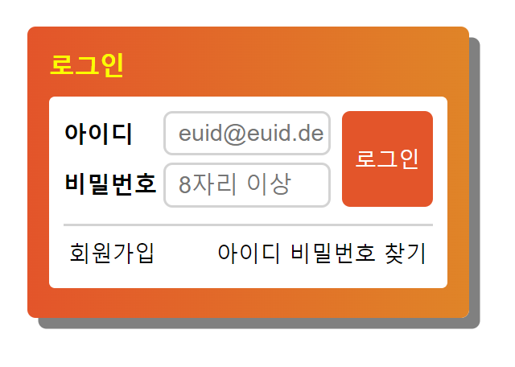
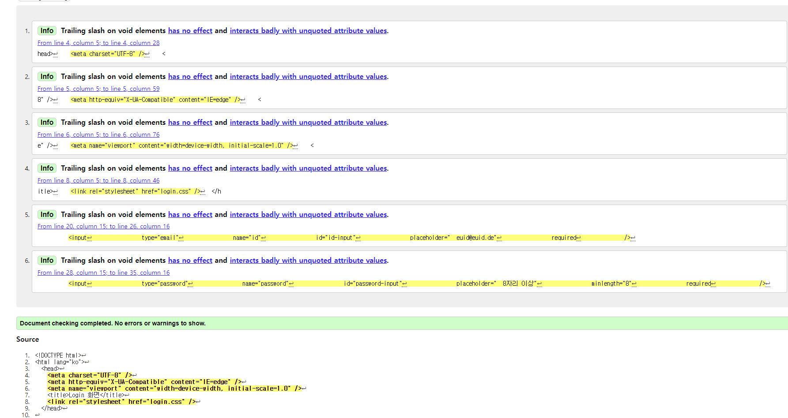

# Login 화면 구성(6/7 과제)




<br>

>HTML
* 로그인의 가장 큰 태그를 **section**이다.
* **아이디, 비밀번호 input 설계** : form > fieldset >legend + div( label + input + button )
* **회원가입, 아이디 비밀번호 찾기 부분 설계** : div (a + a)


#### head 부분
```html
<!DOCTYPE html>
<html lang="ko">
  <head>
    <meta charset="UTF-8" />
    <meta http-equiv="X-UA-Compatible" content="IE=edge" />
    <meta name="viewport" content="width=device-width, initial-scale=1.0" />
    <title>Login 화면</title>
    <link rel="stylesheet" href="login.css" />
  </head>
  ```
#### body 부분

```html
<body>
    <section class="login">
      <h1 class="loginHead">로그인</h1>
      <div class="loginBox">
        <form action="#" method="POST">
          <fieldset class=".a11yHidden">
            <legend>로그인</legend>
            <div class="loginForm__group">
              <label class="idLabel" for="id-input">아이디</label>
              <input
                type="email"
                name="id"
                id="id-input"
                placeholder="  euid@euid.de"
                required
              />
              <label class="pwLabel" for="password-input">비밀번호</label>
              <input
                type="password"
                name="password"
                id="password-input"
                placeholder="  8자리 이상"
                minlength="8"
                required
              />
              <button class="loginButton font-s" type="submit">로그인</button>
            </div>
            <div class="loginSubBox">
              <a class="signUp font-s" href="/">회원가입</a>

              <a class="findId font-s" href="/">아이디 비밀번호 찾기</a>
            </div>
          </fieldset>
        </form>
      </div>
    </section>
  </body>
</html>
```


> CSS
* 아이디, 비밀번호 input영역은 position을 활용했다.
* 회원가입, 아이디/비밀번호 찾기 영역은 float를 활용했다.

```css
/* Accessibility Styles (숨기는 스타일) */
.a11yHidden,
legend {
  overflow: hidden;
  position: absolute !important;
  clip: rect(0, 0, 0, 0);
  clip-path: inset(50%);
  width: 1px;
  height: 1px;
  margin: -1px;
}

/* 전체 기본글자크기 , margin, padding, border 기본값 없애기 */
* {
  font-size: 13px;
  margin: 0;
  padding: 0;
  border: 0;
}

/* 폰트-s 사이즈 지정 */
.font-s{
  font-size: 12px;
}

/* input appearance */
input[type="mail password"]{
  -webkit-appearance: none;
  appearance: none;
}

/* 가장 큰 로그인 주황색 박스 영역*/
.login {
  width: 244px;
  height: 161px;
  background: linear-gradient(to right, #ED552F, #E8852E);
  border-radius: 0.35rem;
  margin: 15px;
  padding: 12px;
  box-sizing: border-box;
  box-shadow: 6px 6px gray;
  
}

/* 제목 폰트 */
.loginHead {
  font-size: 14px;
  color: #FFFF00;
  margin: 0 0 8px 0;
}

/* 두번째 white 로그인 영역 */
.loginBox {
  position: relative;
  width: 220px;
  height: 106px;
  background: white;
  border-radius: 0.25rem;
  padding: 8px 8px 4px 8px;
  box-sizing: border-box;
}

/* 로그인 Input 위치 조정*/
#password-input,
#id-input {
  position: relative;
  left: 55px;
  display: block;
  width: 90px;
  height: 22px;
  border: 1.5px solid lightgray;
  border-radius: 5px;
  padding: 0;
}

#password-input{
  margin: 4px 0 9px 0;
}

/* 로그인 label 위치 조정(position)*/
label {
  position: absolute;
  left: 8px;
  font-weight: 600;
}

.idLabel {
  top: 11px;
}

.pwLabel { 
  top: 39px;
}

/* 로그인 버튼 위치 조정(position) */
.loginButton {
  cursor: pointer;
  position: absolute;
  top : 8px;
  right: 8px;
  width: 50px;
  height: 53px;
  background: #ED552F;
  color: white;
  border: none;
  border-radius: 0.35rem;
}

/* 회원가입, 아이디/비밀번호 찾기 영역 */
.loginSubBox {
  margin-top: 8px;
  margin-bottom: 6px;
  padding: 0 3px;
  border-top: lightgray solid 1.5px;
  height: 36px;
  display: flow-root;
}
/* 회원가입, 아이디/비밀번호 찾기 링크 */
a {
  text-decoration: none;
  color: black;
  margin-top: 0.5rem;
}

/* 회원가입, 아이디/비밀번호 찾기 위치 조정(float) */
.signUp{
  float: left;
}

.findId{
  float: right;
}

```
> HTML 문법 검사

