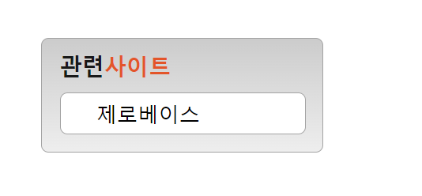
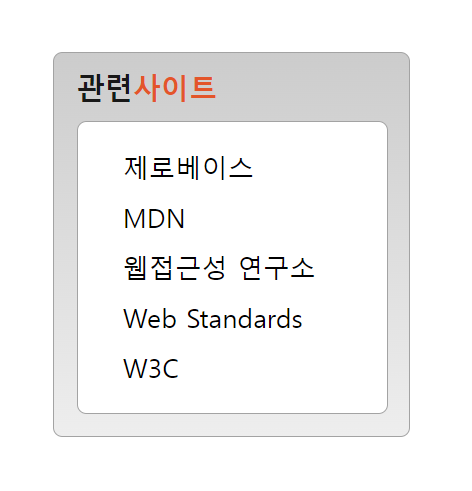
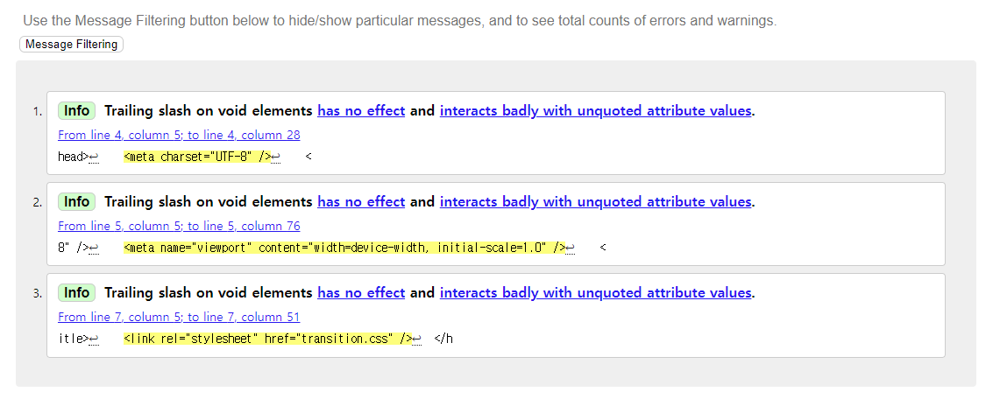

# Transition 과제 (6/9)
### 1. 구현화면
+ closed 상태
  
  

+ open 상태
  
  

### 2. HTML
 
+ section> h2 + ( div > ul > li * 5 >a )
  +  &lt;h1&gt;제목은 사이트 제목이라고 생각해 ***&lt;h2&gt;*** 제목을 주었다.
  +  펼쳐졌을 때 있는 안에 링크  &lt;a&gt;태그들이 리스트로 있기 때문에 ***&lt;ul&gt;로  &lt;a&gt;들을 묶어주었다.***
```html
<!DOCTYPE html>
<html lang="ko">
  <head>
    <meta charset="UTF-8" />
    <meta name="viewport" content="width=device-width, initial-scale=1.0" />
    <title>transition</title>
    <link rel="stylesheet" href="transition.css" />
  </head>
  <body>
    <section class="transition-group">
      <h2 class="header">
        <span class="black">관련</span><span class="orange">사이트</span>
      </h2>
      <div class="transition-box">
        <ul class="link-list">
          <li><a href="#" class="link">제로베이스</a></li>
          <li><a href="#" class="link">MDN</a></li>
          <li><a href="#" class="link">웹접근성 연구소</a></li>
          <li><a href="#" class="link">Web Standards</a></li>
          <li><a href="#" class="link">W3C</a></li>
        </ul>
      </div>
    </section>
  </body>
</html>
```
### 3. CSS
+ 기본 설정 
  + 글자크기, 두께, 색, margin, padding
```css
* {
  margin: 0;
  padding: 0;

}
/* 제목 글자크기, 두께 */
.header {
  display: inline-block;
  padding: 8px 0;
  font-size: 15px;
  font-weight: 700;
}
/* 제목 글자 색 */
.orange{
  color: #ED552F;
}
.black{
  color: #181818;
}
```
---
<br />

+ 가장 큰 박스 설정
  + hover하면 화면이 늘어나기 위해  height: auto; 값을 주었다.
```css
/* 가장 큰 회색 박스 */
.transition-group{
  box-sizing: border-box;
  height: auto;
  width: 190px;
  margin: 30px;
  background: linear-gradient(180deg, #CCCCCC 0%, #EEEEEE 100%);
  padding: 0 12px 12px 12px;
  border: 1px solid #A3A3A3;
  border-radius: 5px;
}
```
---
<br />

+ hover로 늘어나는 박스 설정
  + transition (애니메이션)을 위해 hover을 올리는 박스에 transition: all 300ms ease-in-out;를 주었다.

```css
/* 하얀색 서브 박스 */
.transition-box {
  height: 27px;
  width: 100%;
  background: white;
  border: 1px solid #A3A3A3;
  border-radius: 5px;
  overflow: hidden;
  transition: all 300ms ease-in-out;
  
}
```
---
<br />

+ transition-box, hover 애니메이션 설정
    + .transition-box:hover: 마우스를 올려 화면의 크기를 변화시킨다.
    + height: 145px; : 마우스가 올라갔을때 화면 크기를 늘린다.
    + padding-top: 10px; : 글자를 아래로 내리기 위해 box에 패딩을 준다.
```css
/* 마우스를 올렸을 때 애니메이션(transition) */
.transition-box:hover {
  height: 145px;
  padding-top: 10px;

}
```
---
<br />

+ &lt;ul&gt; ,&lt;a&gt;설정
  + &lt;ul&gt;에 list의 기본값을 없애기위해 list-style-type: none 를 설정한다.
  + &lt;a&gt;에 inline-block을 주어서 margin값을 설정한다.
```css
.link-list {
  list-style-type: none;
}
/* 링크 글자 5개 기본 값 */
.link{
  display: inline-block;
  font-size: 14px;
  font-weight: 400;
  margin: 4px 0;
  text-decoration: 0;
  color: black;
  margin-left: 24px; 
}
```
---
<br />

### 4. html 문법 검사


