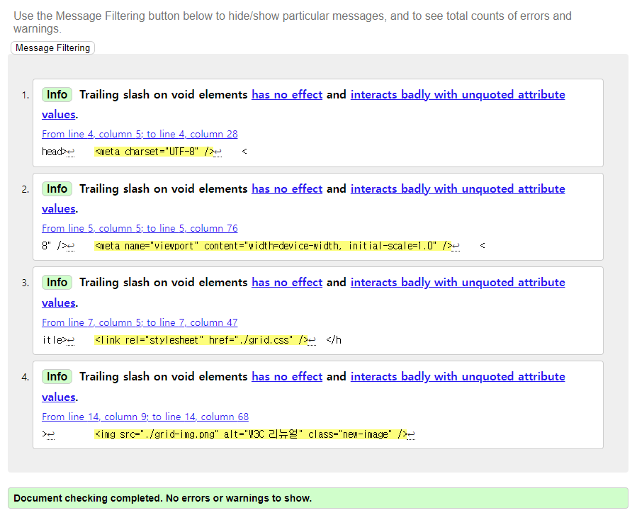

# Grid 관련 과제 (6/12)
### 1. 완성 이미지(기본 버전, 그리드 버전)
  
  


<br />

### 2. HTML
---
- 제목: &lt;h2&gt; 태그
- 구분선 &lt;div&gt;로 구성
- &lt;figure&gt;에 &lt;img&gt;,&lt;figcaption&gt;을 넣어준다.
- &lt;div&gt; 안에 게시글을 넣어준다.
- news의 제목은 강조하기위해 &lt;strong&gt;을 주었다.
- 시간을 표현하기위해 &lt;time&gt; 태그를 준다.
- 더보기는 디자인적으로 맨 위지만, 모든 정보를 준 다음 더보기 링크를 주기위해 맨 밑으로 마크업한다. 
```html
<!DOCTYPE html>
<html lang="ko">
  <head>
    <meta charset="UTF-8" />
    <meta name="viewport" content="width=device-width, initial-scale=1.0" />
    <title>그리드 과제</title>
    <link rel="stylesheet" href="./grid.css" />
  </head>
  <body>
    <section class="news-group">
      <h2 class="header">새소식</h2>
      <div class="hr"></div>
      <figure class="img-box">
        
        <figcaption>W3C 리뉴얼</figcaption>
      </figure>
      <div class="news-info">
        <span><strong> W3C 사이트가 리뉴얼 되었습니다.</strong></span>
        <time class="time" datetime="2022-07-18">2022.07.18</time>
        <p>
          디자인 및 다앙한 view 환경을 고려하여 구성 되어 있으며, 기존보다 최신
          정보 및 개발자를 위한 기술 가이드도 찾기 쉽도록 구성되어 있습니다.
        </p>
      </div>
      <a href="#" class="plus">더보기</a>
    </section>
  </body>
</html>
```


### 3. CSS
---
- Grid 배치로 구성
- Grid 2가지 배치 방법을 모두 설정했다. (수작업ver, 편한 작업ver)
```css
/* 전체 폰트 사이즈 설정 */
* {
  font-size: 14px;
  
}
/* 결과물이 잘보이기 위해 margin*/
body {
  margin: 30px;
}
/* h2 제목 설정(글자,margin) */
.header {
  color: orangered;
  font-weight: 900;
  margin: 0 0 0 19px;
}
/* 더보기 링크 설정*/
.plus {
  display: block;
  color: black;
  font-weight: 700;
  text-decoration: none;
  margin: auto 0;
}
/* 구분선 */
.hr {
  height: 2px;
  width: 340px;
  margin: 0px auto;
  background : linear-gradient(to right, #A9A9A9, #FFFFFF);
}
/* img, figcapton 그룹 설정 */
.img-box {
  max-width: 153px;
  margin:0;
}
/* figcaption 설정 */
.img-box figcaption {
  display: block;
  margin: 0 auto ;
  width: 100%;
  box-sizing: border-box;
  text-align: center;
  transform: translateY(-20px) translateX(25px);
}
/* time 설정 */
.time {
  display: block;
}
/* news 제목 설정 */
.news-info span{
  display: block;
  font-weight: bold;
}


/* 그리드 배치 (수작업ver, 편한 작업ver)*/
.news-group {
  display: grid;
  grid-template-columns: repeat(8, 1fr);
  grid-template-rows: auto;
  gap: 12px;
  max-width: 430px;
  /* grid 편한 ver */
  /* grid-template-areas: 
  "head head . . . . . plus"
  "hr hr hr hr hr hr hr hr"
  "img img img news news news news news"; */
}
/* grid 수작업 ver */
.header {
  grid-area: 1/1/2/3;
}

.hr {
  grid-area: 2/1/3/8;
}


.img-box {
  grid-area: 3/1/4/3;
}

.news-info{
  grid-area: 3/4/4/9;
}

.plus{
  grid-area:1/8/2/9;
}

/* grid 편한 ver */
/* 
.header {
  grid-area: head;
}

.hr {
  grid-area: hr;
}


.img-box {
  grid-area: img;
}

.news-info{
  grid-area: news;
}

.plus{
  grid-area: plus;
} */
```

### 4. 문법 검사
---
