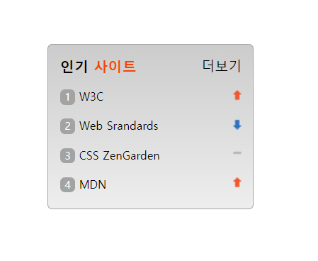
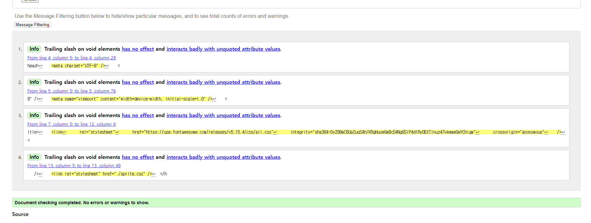

# Sprite 관련 과제 (6/14)
### 1. 완성 이미지
  


<br />

### 2. HTML
---
- 제목: &lt;h2&gt; 태그
- 인기사이트 한 섹션으로 &lt;section&gt; 태그
- 인기사이트 리스트 : &lt;ul&gt;로 순서가있는 리스트로 정해준다.
- 더보기는 디자인적으로 맨 위지만, 모든 정보를 준 다음 더보기 링크를 주기위해 맨 밑으로 마크업한다. 
```html
<!DOCTYPE html>
<html lang="ko">
  <head>
    <meta charset="UTF-8" />
    <meta name="viewport" content="width=device-width, initial-scale=1.0" />
    <title>Sprite 과제</title>
    <link
      rel="stylesheet"
      href="https://use.fontawesome.com/releases/v5.15.4/css/all.css"
      integrity="sha384-DyZ88mC6Up2uqS4h/KRgHuoeGwBcD4Ng9SiP4dIRy0EXTlnuz47vAwmeGwVChigm"
      crossorigin="anonymous"
    />
    <link rel="stylesheet" href="./sprite.css" />
  </head>
  <body>
    <!-- 큰 섹션 -->
    <section class="favorite-section">
      <!-- 제목 -->
      <h2 class="favorite-title">인기 <span class="orange">사이트</span></h2>
      <!-- 숫자가 있는 <ol> 리스트 태그 -->
      <ol class="favorite-listGroup">
        <li class="list1 sprite sprite-1">W3C</li>
        <li class="list2 sprite sprite-2">Web Srandards</li>
        <li class="list3 sprite sprite-3">CSS ZenGarden</li>
        <li class="list4 sprite sprite-4">MDN</li>
      </ol>
      <!-- 더보기 <a> 링크 -->
      <a href="/" class="plus"
        ><span class="far fa-plus" aria-hidden="true"></span>더보기</a
      >
    </section>
  </body>
</html>
```


### 3. CSS
---
- 리스트 오른편 랭킹변화 아이콘은 하나의 'background-image'인 'sprite'로 준다.
- 아이콘가 하나의 이미지에 모아있는 이유는 성능을 좋게하기 위해서이다.
-  각 리스트에서 'background-position'으로 위치를 변경해 아이콘을 바꾼다.
- &lt;ol&gt;태그의 앞 숫자들은 모두 'list-style-type: none;'으로 지우고 '::before' 로 숫자를 다시 준다.
- '더보기'는 부모에 'position: relative;'를 주고 'position: absolute;'를 사용해 맨위에 배치했다. 

```css
/* 시각적으로 잘 볼수있게했다. */
body {
  margin: 50px;
}
/* 인기 사이트 섹션 */
.favorite-section {
  position: relative;
  width: 190px;
  height: 147px;
  background: linear-gradient(180deg, #CCCCCC, #EEEEEE);
  border: 1px solid #A3A3A3;
  border-radius: 5px;
  padding: 12px;
}
/* 인기 사이트 제목 */
.favorite-title {
  font-size: 15px;
  font-weight: 700;
  margin: 0;
}
/* primary color */
.orange {
  color: orangered;
}
/* 더보기 (absolute 사용) */
.plus {
  position: absolute;
  top: 12px;
  right: 12px;
  text-decoration: none;
  color: inherit;
  font-size: 14px;
  font-weight: 400;
}
/* <ol> 리스트 */
.favorite-listGroup {
  font-size: 12px;
  font-weight: 500;
  list-style-type: none;
  margin-top: 4px;
  padding: 0;
}
/* 전체 list에 공통 아이콘 sprite 설정 */
.sprite {
  margin-top: 13px;
  background: url(./rank.png) no-repeat 0 center;
  
}
/* 각 list sprite 설정 (background-position)*/
.sprite-1{
  background-position: 100% 3px ;
}
.sprite-2{
  background-position: 100% -41px ;
}
.sprite-3{
  background-position: 100% -18.5px ;
}
.sprite-4{
  background-position: 100% 3px ;
}

/* 리스트 앞에 공통 번호 박스 (::before)*/
.sprite::before {
  content: "";
  text-align: center;
  display: inline-block;
  width: 16px;
  height: 16px;
  background: #A3A3A3;
  border-radius: 5px;
  margin-right: 4px;
  color: white;
  font-size: 11px;
} 
/* 리스트 각각 숫자 */
.sprite-1::before {
  content: "1";
}
.sprite-2::before {
  content: "2";
}
.sprite-3::before {
  content: "3";
}
.sprite-4::before {
  content: "4";
}
```

### 4. 문법 검사
---
